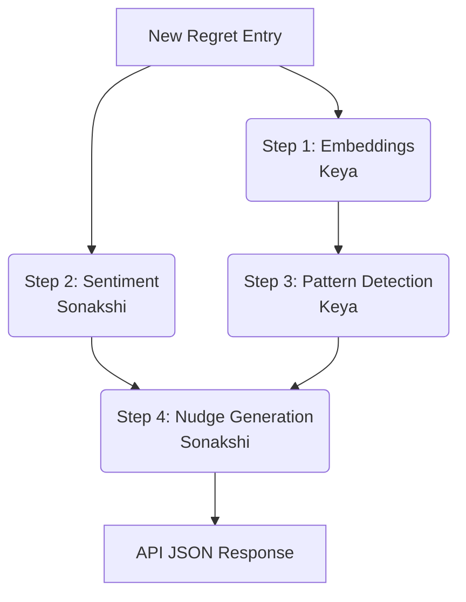

# REMIND App — AI Architecture & Model Choices

## Overview
The REMIND AI Engine is a Python-based FastAPI microservice designed to analyze user regret entries. Its primary goals are to:
1. Detect underlying emotions in user entries
2. Identify behavioral patterns by comparing new entries to past ones
3. Generate personalized nudges to intercept impulsive behavior

To prioritize privacy, latency, and cost-efficiency, the engine utilizes small, locally-hosted models rather than relying exclusively on large third-party APIs (like OpenAI) for core classification tasks.

---

## Model Selection

### 1. Emotion Classification (Sentiment)
**Author:** Sonakshi
**Chosen Model:** `j-hartmann/emotion-english-distilroberta-base` (via Hugging Face)

**Why this model instead of OpenAI?**
- **Speed:** DistilRoBERTa is highly compressed and optimized for fast inference on CPU, providing near-instant responses.
- **Privacy:** User regret entries are deeply personal. Keeping inference local guarantees that sensitive emotional data is not transmitted to external LLM providers.
- **Cost:** Running a local classification model is free, whereas using an OpenAI API per entry scales linearly with usage.
- **Specificity:** Unlike general-purpose sentiment models (Positive/Negative/Neutral), this model is specifically fine-tuned to classify 7 distinct human emotions (*anger, disgust, fear, joy, neutral, sadness, surprise*), which is critical for generating targeted psychological nudges.

### 2. Text Representation (Embeddings)
**Author:** Keya
**Chosen Model:** `sentence-transformers/all-MiniLM-L6-v2`

**Why this model?**
- **Efficiency:** The MiniLM series provides state-of-the-art semantic text embeddings while remaining exceptionally lightweight (approx. 80MB).
- **Quality:** It generates dense 384-dimensional vectors that capture deep semantic meaning, perfect for comparing the nuance of "I snapped at my roommate" vs "I yelled at my coworker", which simple keyword matching would fail to connect.
- **Standardization:** It maps seamlessly into scikit-learn's cosine similarity calculations for pattern detection.

---

## Pipeline & Data Flow

When a user submits a new regret entry to the `/analyze` endpoint, it passes through an asynchronous 4-step pipeline:

### The Data Contract
To facilitate collaboration between Keya's core pipeline and Sonakshi's intelligence outputs, the following internal data contract is enforced:

1. **Sentiment Output:**
   Passes `{dominant_emotion, confidence, all_emotions}` to the nudge generator.
2. **Pattern Output:**
   Compares the new embedding against past embeddings (threshold >= 0.4). Passes `{pattern_detected, similar_count}` to the nudge generator.
3. **Nudge Input:**
   Requires both the `dominant_emotion` and the `similar_count` to determine the intervention message and the urgency level (Low/Medium/High).

---

## Future Considerations

- **Database Integration:** Currently, past entries are passed in the request body. In production, the microservice will connect securely to the primary database to retrieve user history automatically.
- **Scaling:** If inference latency becomes an issue under heavy load, the FastAPI service can be scaled horizontally using multiple Uvicorn workers, or we can offload embedding generation to a dedicated GPU instance.
- **Advanced Nudges:** Future iterations could incorporate an LLM purely for *nudge formulation*, taking the structured outputs of our local models (Emotion=Anger, Count=3) to generate dynamic, non-repetitive advice via prompt engineering.
